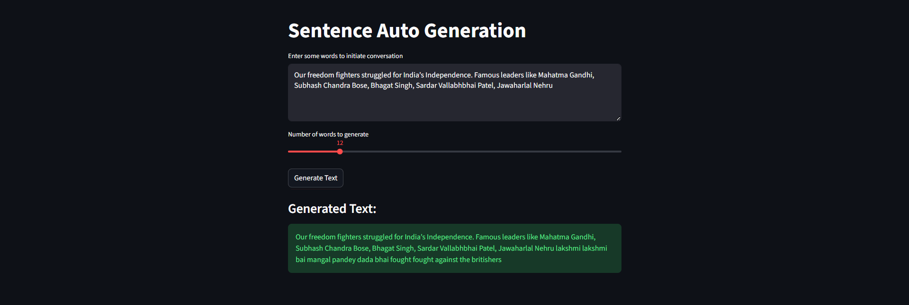
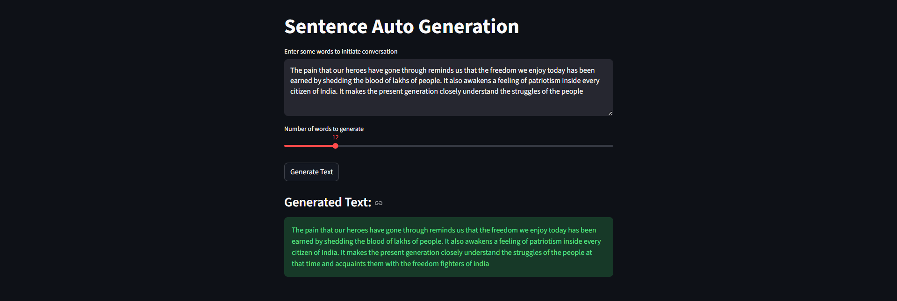

# Chatbot Text Generation System

## Problem Statement
The goal of this project is to develop a deep learning-based chatbot capable of generating human-like text sequences given a seed phrase. The system focuses on natural language modeling, enabling contextual word prediction and coherent sentence generation. This solution can be integrated into conversational AI applications, content generation pipelines, or customer support automation systems.

---

## Technologies Used
- **Programming Language:** Python 3.10  
- **Deep Learning Framework:** TensorFlow and Keras  
- **Web Framework:** Streamlit for interactive UI  
- **Data Preprocessing:** Keras Tokenizer, sequence padding, categorical encoding  
- **Model Architecture:** LSTM-based sequential neural network with embedding layers  
- **Containerization:** Docker for deployment and portability  
- **Version Control & Project Structure:** Organized Python packages with modular design  

---

## Project Architecture

The project is modularized into the following main components:

### 1. Model Definition
**ChatbotModel Class:**  
Implements the sequential LSTM model for text generation.  

- Embedding layer converts word indices into dense vectors.  
- Two stacked LSTM layers capture sequential dependencies.  
- Dropout layers prevent overfitting.  
- Dense layer with softmax activation predicts the next word in the sequence.  

**Best Practices Implemented:**  
- Proper separation of model building and compilation logic.  
- Configurable architecture parameters (embedding dimension, LSTM units, dropout rates).  
- Reusable methods for retrieving model summary and compiled model.

### 2. Data Preprocessing
**DataPreprocessor Class:**  
Handles preparation of textual data for model training.  

- Tokenization converts text into integer sequences.  
- Input sequences are generated with incremental word tokens.  
- Padding ensures uniform sequence lengths.  
- Features and labels are split for supervised learning.  
- Labels are one-hot encoded for categorical cross-entropy loss.  

**Best Practices:**  
- Modular methods for sequence creation, padding, and feature-label split.  
- Maximum sequence length dynamically determined from data.  
- Vocabulary size automatically calculated and exposed.

### 3. Model Training
**ModelTrainer Class:**  
Manages training, saving, and inference of the model.  

- Supports flexible epochs and batch sizes.  
- Saves trained model, tokenizer, and training history for reproducibility.  
- Provides text generation utility from a seed phrase.  

**Best Practices:**  
- Ensures directories exist before saving models.  
- Records detailed training history in CSV format for analysis.  
- Encapsulates both model and tokenizer loading for inference consistency.

### 4. Model Configuration
**ModelConfig Class:**  
Centralized configuration for model, training, and inference parameters.  

- Defines embedding size, LSTM units, dropout rates.  
- Sets training parameters: epochs, batch size, learning rate.  
- Specifies data processing settings: padding and truncation type, maximum sequence length.  
- Inference parameters for prediction length and optional delay handling.  

**Best Practices:**  
- Centralized configuration allows easy hyperparameter tuning.  
- Prevents hardcoding values throughout the codebase.

### 5. Streamlit Deployment
- Provides an interactive web interface for text generation.  
- Users can input a seed phrase and select the number of words to generate.  
- Dynamically uses the trained model and tokenizer for inference.  

**Best Practices:**  
- Caching model and tokenizer loading to improve performance.  
- Handles input preprocessing and padding consistently with training.  
- Clear user feedback for successful model loading and text generation.

### 6. Docker Deployment
- Dockerfile builds the environment with all dependencies.  
- Exposes Streamlit application on port 8501.  
- Supports volume mounting for easy local development and model updates.  

**Best Practices:**  
- Uses official slim Python image for lightweight containers.  
- Separate dependency installation step to optimize build caching.  
- Ensures container runs Streamlit server on all network interfaces.

---

---

## How to Use

### Training
1. Prepare your text dataset.  
2. Instantiate `DataPreprocessor` and `ChatbotModel`.  
3. Use `ModelTrainer` to train the model with desired epochs and batch size.  
4. Save model, tokenizer, and training history for later use.

### Inference
1. Load the trained model and tokenizer.  
2. Provide a seed phrase.  
3. Generate text using the `generate_text` method or via the Streamlit interface.

### Steps to run
1. Build the Docker image:  
   ```bash
   `docker build -t chatbot_app`
   ```


2. Run the container:
   ```bash
    `docker-compose up`
    ```

3. Access the Streamlit interface at 
    ```bash
    `http://localhost:8501`
    ```

---

---

###  Test Results

#### Output 1


#### Output 2


#### Output 3

 
## Limitations

Despite its functional design and modular architecture, the system has a few inherent limitations:

1. **Limited Context Understanding:**  
   The LSTM-based model generates text based on short preceding sequences and cannot capture long-range contextual dependencies like transformer-based models (e.g., GPT or BERT).

2. **Data Dependency:**  
   The quality and diversity of generated text are highly dependent on the dataset used for training. Poor or domain-limited data will result in repetitive or incoherent outputs.

3. **Vocabulary Constraints:**  
   Since the tokenizer is trained on a fixed vocabulary, any out-of-vocabulary words or unseen expressions during inference may cause generic or inaccurate predictions.

4. **Lack of Semantic Awareness:**  
   The model predicts next words based on statistical likelihood rather than true semantic understanding, leading to grammatically correct but contextually irrelevant sentences.

5. **Static Response Generation:**  
   The chatbot does not maintain conversational memory or dialogue history — each generation is independent of prior context.

6. **Compute and Training Time:**  
   LSTM-based models can be computationally expensive to train on large corpora and may not fully leverage parallelization like modern transformer architectures.

7. **Limited Scalability for Real-Time Use:**  
   Although suitable for prototypes and demos, real-time interactive deployment may require GPU acceleration or optimization for low-latency responses.